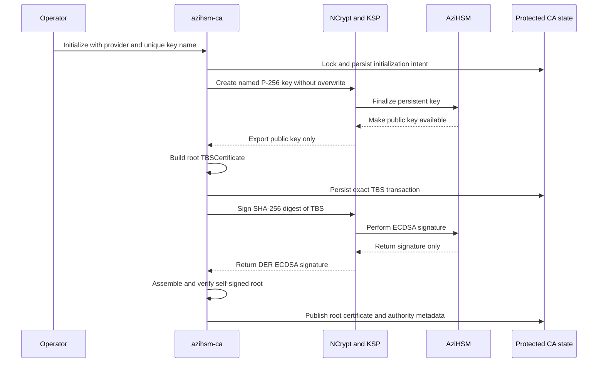
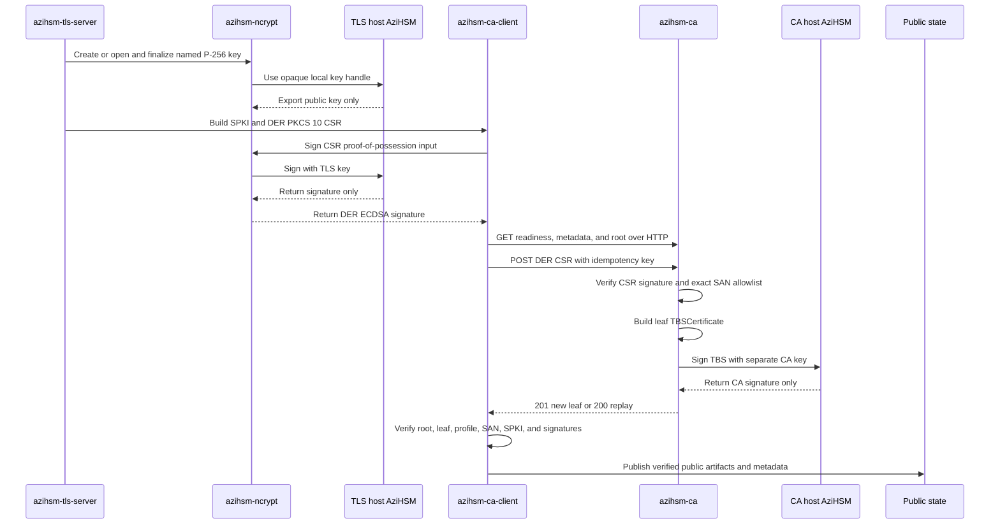
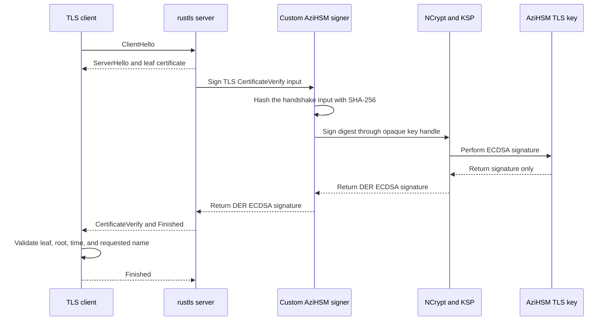
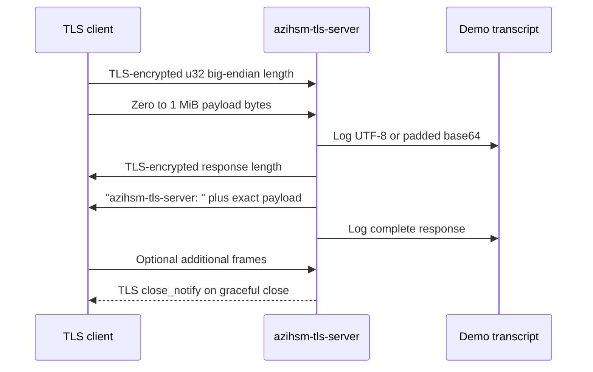

# AziHSM TLS Proof-of-Concept

[**Azure Integrated HSM**](https://github.com/microsoft/AziHSM-Guest) (**AziHSM**) is a **Hardware Security Module** (**HSM**) that enables the creation, caching, and usage of cryptographic keys within an isolated hardware environment.
Latest Azure VM generations have the option to attach to a local AziHSM device, which can be used to store keys locally and use the AziHSM device's crypto engines to perform crypto operations.

AziHSM supports a variety of customer scenarios.
However, throughout our testing and development, one scenario we haven't visited is using AziHSM to manage keys for a [**Transport Layer Security**](https://www.cloudflare.com/learning/ssl/transport-layer-security-tls/) (**TLS**) server.
This project aims to explore that scenario; this repository contains the files and code from our 2026 hackathon project.

## Project Agenda

The end goal of this project is to demonstrate a three-VM setup, where each VM uses a separate AziHSM device to enable TLS communication:

1. **VM 1** - Implement a basic **Mock CA** (**Certificate Authority**).
    * This Mock CA will use the AziHSM device to issue a mock certificate to our TLS Server.
2. **VM 2** - Implement a basic **TLS Server**.
    * This TLS Server will communicate with the Mock CA to receive a certificate and associate it with its own public/private key pair, with which it enables secure communication with a TLS Client.
3. **VM 3** - Implement a basic **TLS Client**.
    * This TLS Client will reach out to the TLS Server for secure communication.

### Tasks

| **Task** | **Status** | **Description** |
|----------|------------|-----------------|
| Implement Mock CA | Done | See [`azihsm-ca`](crates/azihsm-ca) |
| Initialize named TLS keys | Done | See [`keytool`](crates/keytool) |
| Implement TLS Server | Done | See [`azihsm-tls-server`](crates/azihsm-tls-server) |
| Test TLS-Server-to-Mock-CA certificate issuing | Done | See the [TLS server guide](docs/azihsm-tls-server.md) |
| Implement TLS Client | Done | See [`azihsm-tls-client`](crates/azihsm-tls-client) |
| Test TLS-Client-to-TLS-Server communication | Done | See the [TLS client guide](docs/azihsm-tls-client.md) |
| Test full workflow | Done | |
| Record demonstration of full workflow | TODO | |

## Rust Crates

This repo contains multiple Rust crates:

* [`azihsm-ca`](crates/azihsm-ca) - A mock CA (Certificate Authority) server.
* [`azihsm-ca-client`](crates/azihsm-ca-client) - Neutral CA protocol, transcript, CSR, and certificate-verification primitives shared by `azihsm-ca-demo` and `azihsm-tls-server`.
* [`azihsm-ca-demo`](crates/azihsm-ca-demo) - A sample application demonstrating how a client would communicate with the mock CA server (`azihsm-ca`).
* [`azihsm-ncrypt`](crates/azihsm-ncrypt) - A helper crate implementing shared code to interact with the AziHSM KSP in Windows.
* [`azihsm-tls-server`](crates/azihsm-tls-server) - A TLS 1.3 framed echo server whose persistent private key remains in AziHSM.
* [`keytool`](crates/keytool) - A CLI that initializes and exercises named AziHSM TLS keys (the key-management foundation for the TLS Server).
* [`azihsm-tls-client`](crates/azihsm-tls-client) - A TLS client that validates a server against a specific CA root and exchanges a message (no AziHSM dependency).

## How it Works

This project implements three major components, all of which rely on AziHSM to manage its keys and perform TLS-related cryptographic operations:

1. **AziHSM CA Server** - A simple, mock Certificate Authority that uses an AziHSM key to produce its own root certificate, and to produce signed leaf certificates for requesters.
2. **AziHSM TLS Server** - A simple TLS server that uses an AziHSM key for TLS communications, and contacts the CA server to receive a leaf certificate for its TLS key.
3. **AziHSM TLS Client** - A simple TLS client that communicates with the TLS server to establish a secure channel and pass messages back and forth.

### CA Initialization & Root Self-Signing

(How the CA Server initializes itself and creates its root certificate.)

<details>
<summary>(Click to Expand)</summary>

A PKCS #10 CSR is a request signed by the requesting key. A
`TBSCertificate` is the exact certificate body that a CA signs. Root
initialization does not enroll a CSR: it constructs a root
`TBSCertificate`, signs it with the root's own AziHSM key, and publishes the
resulting self-signed certificate.



The root certificate is a public trust anchor. Fetching it from the CA is
useful distribution, but a relying party must authenticate its fingerprint or
provenance independently before trusting it.

</details>

### The TLS Server Enrollment

(How the TLS Server enrolls its key with the CA)

<details>
<summary>(Click to Expand)</summary>

The CA service is contacted only when the TLS server needs initial enrollment
or startup renewal. The POST body uses `application/pkcs10` and contains raw
DER PKCS #10, not JSON. Readiness, metadata, and errors are JSON; root and leaf
certificates are DER on the wire and may be rendered as PEM in transcripts.



</details>

### The TLS Handshake

(Between the TLS Server and TLS Client)

<details>
<summary>(Click to Expand)</summary>

The server uses rustls with TLS 1.3 only, ECDSA P-256/SHA-256, no client
certificate authentication, no tickets or resumption, and no early data.



The `CertificateVerify` input is TLS handshake data, not a certificate or
CSR. The private key never returns to rustls. In this one-way TLS design, the
client authenticates the server; the server does not certificate-authenticate
the client.

</details>

### Exchanging Secure Messages

(Between the TLS Server and TLS Client)

<details>
<summary>(Click to Expand)</summary>

After the handshake, the application protocol carries arbitrary bytes in
length-prefixed frames.



</details>

## Quick Start

On Windows with Rust 1.88+ and the AziHSM KSP, build both required binaries:

```powershell
cargo build --locked --manifest-path .\crates\Cargo.toml `
    -p azihsm-ca -p azihsm-ca-demo `
    --release --target x86_64-pc-windows-msvc
```

Initialize and serve the demo-only plain-HTTP CA using the
[`azihsm-ca` operator guide](docs/ca-server-usage.md), then enroll with the
[`azihsm-ca-demo` guide](docs/azihsm-ca-demo.md):

```powershell
New-Item -ItemType Directory -Force C:\azihsm-demo | Out-Null
.\crates\target\x86_64-pc-windows-msvc\release\azihsm-ca.exe init `
    --state-dir C:\azihsm-demo\ca-state `
    --provider 'Microsoft Azure Integrated HSM Key Storage Provider' `
    --key-name ('azihsm-ca-' + [Guid]::NewGuid().ToString('N'))

.\crates\target\x86_64-pc-windows-msvc\release\azihsm-ca.exe serve `
    --state-dir C:\azihsm-demo\ca-state `
    --allow-dns server.demo
```

In a second PowerShell terminal:

```powershell
.\crates\target\x86_64-pc-windows-msvc\release\azihsm-ca-demo.exe create `
    --output-dir C:\azihsm-demo\tls-server `
    --subject-cn server.demo `
    --dns server.demo `
    --ca-url http://127.0.0.1:8080 `
    --acknowledge-plain-http
```

The TLS private key remains non-exportable in AziHSM; the demo prints its
public wire transcript.

To enroll and run the actual TLS server instead, build
`azihsm-tls-server` and follow the
[TLS server guide](docs/azihsm-tls-server.md). The demo and server are
independent applications that share only neutral libraries; use separate
state directories.

```powershell
cargo build --locked --manifest-path .\crates\Cargo.toml `
    -p azihsm-tls-server --release --target x86_64-pc-windows-msvc

.\crates\target\x86_64-pc-windows-msvc\release\azihsm-tls-server.exe run `
    --state-dir C:\azihsm-demo\tls-service `
    --dns server.demo `
    --ca-url http://127.0.0.1:8080 `
    --acknowledge-plain-http
```

## Learning Resources

* **Certificate Authorities** (**CA**)
    * [What is a certificate authority?](https://www.youtube.com/watch?v=8ItJ-VqYo_s)
    * [Security-AzureConfidentialVM - `WincryptX509.cpp`](https://msazure.visualstudio.com/One/_git/Security-AzureConfidentialVM?path=%2Fsrc%2FSecretsProvisioningLibrary%2FWindows%2FWincryptX509.cpp) - Demonstration of using Windows APIs to construct, sign, load, and validate X509 certs.
    * [azure-cli-extensions - `create_certchain.sh`](https://github.com/Azure/azure-cli-extensions/blob/main/src/confcom/samples/certs/create_certchain.sh) - Shell script that uses OpenSSL on Linux to generate a certificate chain.
