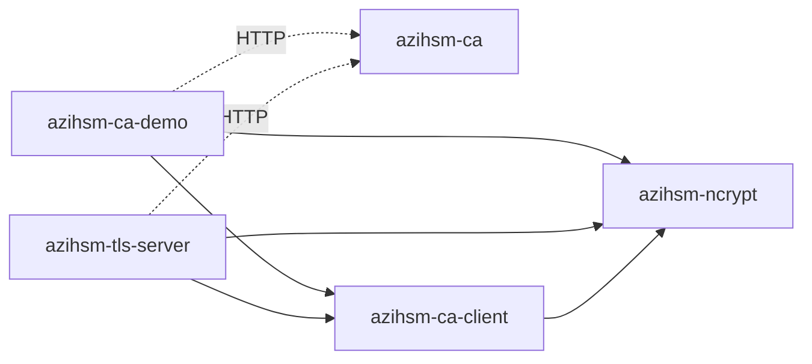

# AziHSM TLS Server

`azihsm-tls-server` demonstrates a one-way TLS 1.3 service whose persistent
ECDSA P-256 private key remains in the current Windows user's AziHSM Key
Storage Provider. The process enrolls through the repository's plain-HTTP
demonstration CA, verifies and caches the public certificate chain, and then
uses NCrypt for every TLS `CertificateVerify` signature.

Private-key bytes and native handles are never exported, stored, or printed.
The server has no RSA path, software signing fallback, TLS 1.2, session
resumption, tickets, 0-RTT, client authentication, or application
authentication.

## Component Boundaries



`azihsm-ca-demo` and `azihsm-tls-server` are independent applications.
Neither depends on the other. `azihsm-ca-client` contains neutral CA protocol,
DTO, transcript, validation, CSR, certificate-verification, public-artifact,
deletion-intent, and cross-application lock primitives. Server cache
generations, renewal selection, and TLS runtime remain server-owned; each
application retains its own CLI and command orchestration. `azihsm-ca` does
not depend on the client library.

## Prerequisites

* Windows with Rust 1.88 or newer and the
  `x86_64-pc-windows-msvc` target.
* The current-user
  `Microsoft Azure Integrated HSM Key Storage Provider`.
* A running [`azihsm-ca`](ca-server-usage.md) whose exact `--allow-dns` and
  `--allow-ip` values authorize every requested SAN.
* A fresh absolute local state directory without reparse points.
* A firewall rule allowing only the intended TLS clients.

The CA URL is deliberately `http://` and requires explicit acknowledgement.
Application clients always use TLS. The two transport boundaries are
independent: `--listen` controls the TLS socket, while CA `--allow-dns` and
`--allow-ip` control certificate authorization.

## Build

Run from the repository root:

```powershell
cargo build --locked --manifest-path .\crates\Cargo.toml `
    -p azihsm-ca -p azihsm-tls-server `
    --release --target x86_64-pc-windows-msvc
```

## Start the CA

Initialize the CA once:

```powershell
$CaExe = Resolve-Path `
    .\crates\target\x86_64-pc-windows-msvc\release\azihsm-ca.exe
$CaState = 'C:\azihsm-demo\ca-state'

& $CaExe init `
    --state-dir $CaState `
    --provider 'Microsoft Azure Integrated HSM Key Storage Provider' `
    --key-name ('azihsm-ca-' + [Guid]::NewGuid().ToString('N'))
```

Start a loopback CA that authorizes the TLS server's DNS SAN:

```powershell
& $CaExe serve `
    --state-dir $CaState `
    --listen '127.0.0.1:8080' `
    --allow-dns 'server.demo'
```

`127.0.0.1` is only the CA bind address. It is not an authorized IP SAN.

## Run

In another PowerShell terminal:

```powershell
$ServerExe = Resolve-Path `
    .\crates\target\x86_64-pc-windows-msvc\release\azihsm-tls-server.exe
$ServerState = 'C:\azihsm-demo\tls-server'

& $ServerExe run `
    --state-dir $ServerState `
    --listen '127.0.0.1:8443' `
    --dns 'server.demo' `
    --ca-url 'http://127.0.0.1:8080' `
    --acknowledge-plain-http
```

`--listen` defaults to `127.0.0.1:8443`. Repeat `--dns` and `--ip` for every
certificate SAN. At least one SAN is required, values must be unique, DNS
names are lowercase ASCII LDH names, and wildcards are unsupported.
`--key-name` is optional on first use; when supplied later it must exactly
match the persisted identity.

Preparation is synchronous and finishes before the Tokio runtime starts. It
creates or opens the named key, performs its known-answer test, validates the
public SPKI, contacts the CA when renewal is required, verifies the exact
certificate profile, selects the best generation, and retains the state lock
for the server lifetime.

CA leaves are valid for at most seven days, so every later startup attempts
renewal. A currently valid, identity-matching cached certificate may be used
only when the CA failure is classified as availability-related. Protocol,
schema, profile, authority, root, SAN, SPKI, not-yet-valid, expired, or
unknown failures fail closed.

## TLS Behavior

The server uses the rustls ring protocol provider with TLS 1.3 only:

* one-way TLS with no client certificate;
* ECDSA P-256 with SHA-256 only;
* leaf certificate and any non-root intermediates in the transmitted chain;
  the current direct-root CA therefore transmits exactly the leaf;
* no tickets, session storage, resumption, early data, ALPN, or key logging;
* one logical AziHSM `CertificateVerify` signature per full handshake;
* at most 64 admitted TCP connections.

The 65th accepted TCP connection is immediately rejected before TLS. Closing,
timing out, aborting, or completing a connection returns its permit.
Handshakes have a 10-second timeout, one complete request frame has a
30-second timeout, and writes and close notification have a 10-second
timeout. Every deadline is clamped to certificate expiry. The listener stops
and active work is drained for at most ten seconds on Ctrl+C, but serving
never continues at or after certificate expiry.

## Frame Protocol

Every request and response is:

1. A four-byte unsigned big-endian payload length.
2. Exactly that many payload bytes.

Requests may contain zero through `1,048,576` bytes. Each response payload is
the fixed 19-byte prefix `azihsm-tls-server: ` followed by the exact request.
Therefore the maximum response payload is `1,048,595` bytes and the maximum
response wire frame is `1,048,599` bytes.

A zero-length request receives the 19-byte prefix. Multiple frames may be
sent on one TLS connection. An oversized declaration, partial header,
partial payload, timeout, or TLS failure closes the connection without an
application response. Normal EOF and graceful draining send TLS
`close_notify`.

## Test with PowerShell and .NET

Install the CA root for the testing account only after independently checking
its fingerprint:

```powershell
certutil.exe -dump "$CaState\root.der"
certutil.exe -addstore -user Root "$CaState\root.der"
```

Map `server.demo` to the TLS server address in the test environment, then use
.NET `SslStream` so hostname and Windows-root validation remain enabled:

```powershell
$Tcp = [Net.Sockets.TcpClient]::new('server.demo', 8443)
$Tls = [Net.Security.SslStream]::new($Tcp.GetStream(), $false)
$Options = [Net.Security.SslClientAuthenticationOptions]::new()
$Options.TargetHost = 'server.demo'
$Options.EnabledSslProtocols = [Security.Authentication.SslProtocols]::Tls13
$Tls.AuthenticateAsClient($Options)

$Request = [Text.Encoding]::UTF8.GetBytes('hello')
$Header = [BitConverter]::GetBytes(
    [Net.IPAddress]::HostToNetworkOrder([int]$Request.Length))
$Tls.Write($Header)
$Tls.Write($Request)
$Tls.Flush()

$ResponseHeader = [byte[]]::new(4)
$Tls.ReadExactly($ResponseHeader)
$ResponseLength = [Net.IPAddress]::NetworkToHostOrder(
    [BitConverter]::ToInt32($ResponseHeader))
$Response = [byte[]]::new($ResponseLength)
$Tls.ReadExactly($Response)
[Text.Encoding]::UTF8.GetString($Response)

$Tls.Dispose()
$Tcp.Dispose()
```

The expected response is `azihsm-tls-server: hello`. Remove the test trust
anchor when finished:

```powershell
$Certificate = Get-ChildItem Cert:\CurrentUser\Root |
    Where-Object Subject -eq 'CN=AziHSM Demo Root'
$Certificate | Remove-Item
```

For a private network, bind the CA and TLS server to specific interface
addresses, authorize the same DNS/IP SANs requested by the server, configure
name resolution, provision the CA root independently on the client, and
restrict both ports with Windows Firewall. Never infer certificate
authorization from a bind address.

## Public State and Renewal

The state directory contains the immutable request metadata, public SPKI,
CSR, root and leaf certificates, issuance metadata, deletion intent/record,
and completed renewal generations. It never contains a private key.

Both applications use the same `.azihsm-state.lock` implementation backed by
exclusive Windows `LockFileEx`. The server holds it from identity preparation
until all TLS tasks and AziHSM signing have drained. Demo and server
show/delete/mutation commands fail closed while that lock is held and recover
after release. State directories should still be application-specific.
Completed renewals are selected by validity and verification metadata; the
selected generation and two recent validated generations are retained.
Incomplete or invalid generations are never silently selected or pruned.

`root.der` remains public state for independent client trust provisioning and
cache verification. It is not sent by rustls as part of the server certificate
chain.

## Inspect and Delete

Display public identity and certificate metadata:

```powershell
& $ServerExe show --state-dir $ServerState
```

Stop the server before deleting its key. Copy the exact key name printed by
`show`:

```powershell
& $ServerExe delete-key `
    --state-dir $ServerState `
    --confirm-key-name 'azihsm-tls-EXACT_NAME'
```

Deletion publishes an identity-bound durable intent before calling
`NCryptDeleteKey`. Repeating the command safely recovers interruption after
key deletion, verifies absence, and publishes the final deletion record.

## Logging and Transcript

Tracing is compact, timestamp-free, non-ANSI stdout. `RUST_LOG` accepts only
`off`, `error`, `warn`, `info`, `debug`, or `trace`; the default is `info`.
CA request/response and local JSON/PEM transcripts remain default-on even
when tracing is off.

Application message transcripts are also deterministic and include
connection ID, frame sequence, direction, exact byte length, encoding, and
the complete content. Valid UTF-8 is printed as text; other bytes use standard
padded base64. Content is never truncated. A 1 MiB binary request produces
1,398,104 base64 bytes, and its response is slightly larger. This
user-selected observability behavior can create approximately 1.4 MB log
records and is an intentional demonstration denial-of-service risk.

Logs never contain private-key bytes, native handles, TLS traffic secrets, or
unrestricted internal debug values.

## Demonstration Limits

This server is not production-ready:

* The CA transport is unauthenticated plain HTTP.
* Enrollment is unauthenticated and constrained only by exact CA SAN
  allowlists.
* Application clients are not authenticated or authorized.
* There is no revocation, in-process renewal, SNI routing, or rate limiting
  beyond the connection cap and fixed timeouts.
* Any process running as the same Windows user may be able to ask the
  provider to use the named key.
* Full message logging intentionally exposes application payloads and can
  amplify storage and console load.

Use isolated test machines, narrow firewall rules, short-lived test trust,
and non-sensitive messages.
